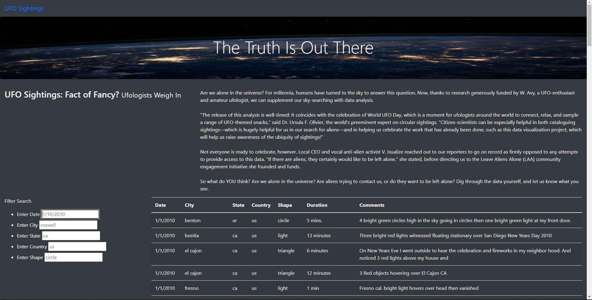
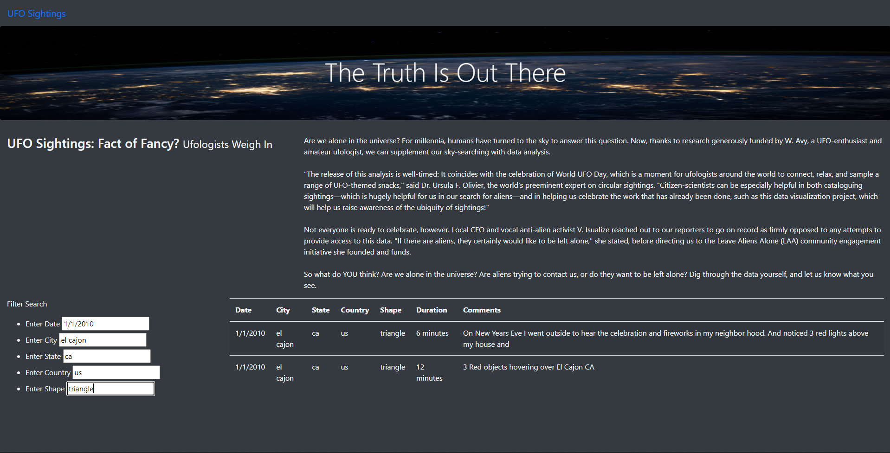

# UFOs
## Overview
The purpose of this analysis was to create a html webpage, that includes an article and a table, from a javascript data file containing UFO sightings.  

---
## Results
There are five filters you can use to drill down into specfic sightings. You can filter by date, city, state, country, and shape. The image below shows UFO sightingss based on the following filters:
- date: 1/1/2010
- city: el cajon
- state: ca
- country: us
- shape: triangle

---
## Summary
- One drawback of this design is that the data source isn't being updated as new sightings occur.
- A few recommendations I have for further development is to:
  1. Add functionality to have the data update automatically as new information becomes available, 
  2. Incorporate images or videos to the sightings if available, and
  3. Provide information for the person who reported the sighting (with their consent of course).
